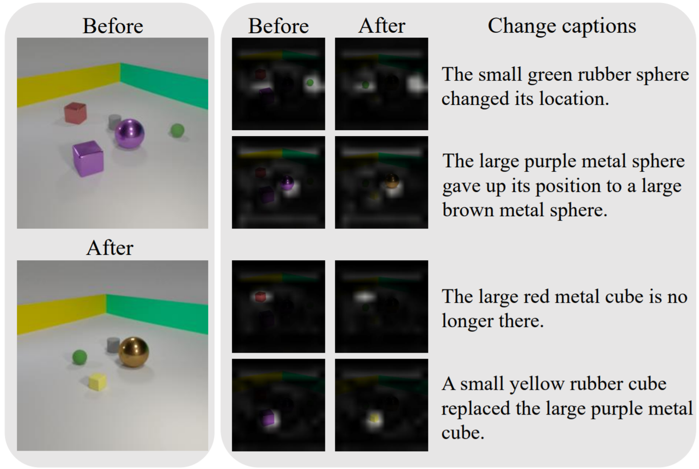

<div style="width:100%;text-align:center"></div>

# Abstract
Existing change captioning studies have mainly focused on a single change. However, detecting and describing multiple changed parts in image pairs is essential for enhancing adaptability to complex scenarios. We solve the above issues from three aspects: (i) We propose a simulation-based multi-change captioning dataset; (ii) We benchmark existing state-of-the-art methods of single change captioning on multi-change captioning; (iii) We further propose Multi-Change Captioning transformers (MCCFormers) that identify change regions by densely correlating different regions in image pairs and dynamically determines the related change regions with words in sentences. The proposed method obtained the highest scores on four conventional change captioning evaluation metrics for multi-change captioning. Additionally, our proposed method can separate attention maps for each change and performs well with respect to change localization. Moreover, the proposed framework outperformed the previous state-of-the-art methods on an existing change captioning benchmark, CLEVR-Change, by a large margin (+6.1 on BLEU-4 and +9.7 on CIDEr scores), indicating its general ability in change captioning tasks. The code and dataset are available at the project page.

# Paper

**[Describing and Localizing Multiple Change with Transformers](https://arxiv.org/abs/2103.14146)**
<br> Yue Qiu\*, Shintaro Yamamoto\*, Kodai Nakashima, Ryota Suzuki, Kenji Iwata, Hirokatsu Kataoka, Yutaka Satoh
<br> \* Equal contribution.  
**Present at ICCV2021.**

# Dataset and code
Dataset and code used in the paper [can be found here](https://github.com/cvpaperchallenge/Describing-and-Localizing-Multiple-Change-with-Transformers).

If you find our work helpful, please cite the paper:
```
@misc{qiu2021describing,
    title={Describing and Localizing Multiple Changes with Transformers},
    author={Yue Qiu, Shintaro Yamamoto, Kodai Nakashima, Ryota Suzuki, Kenji Iwata, Hirokatsu Kataoka, and Yutaka Satoh},
    year={2021},
    eprint={2103.14146},
    archivePrefix={arXiv},
    primaryClass={cs.CV}
}
```

