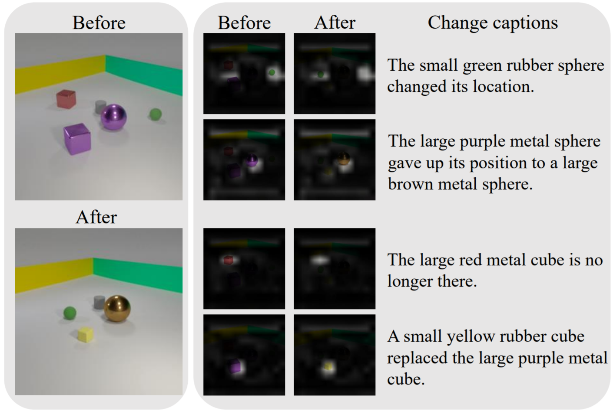

# Abstract
Change captioning tasks aim to detect changes in imagepairs observed before and after a scene change and gen-erate a natural language description of the changes. Existing change captioning studies have mainly focused onscenes with a single change. However, detecting and de-scribing multiple changed parts in image pairs is essential for enhancing adaptability to complex scenarios. Wesolve the above issues from three aspects: (i) We propose aCG-based multi-change captioning dataset; (ii) We benchmark existing state-of-the-art methods of single change cap-tioning on multi-change captioning; (iii) We further pro-pose Multi-Change Captioning transformers (MCCFormers) that identify change regions by densely correlating dif-ferent regions in image pairs and dynamically determinesthe related change regions with words in sentences. The proposed method obtained the highest scores on four con-ventional change captioning evaluation metrics for multi-change captioning. In addition, existing methods generate a single attention map for multiple changes and lack the abil-ity to distinguish change regions. In contrast, our proposedmethod can separate attention maps for each change and performs well with respect to change localization. More-over, the proposed framework outperformed the previousstate-of-the-art methods on an existing change captioning benchmark, CLEVR-Change, by a large margin (+6.1 onBLEU-4 and +9.7 on CIDEr scores), indicating its generalability in change captioning tasks.

# Paper
Qiu Yue\*, Shintaro Yamamoto\*, Ryota Suzuki, Kenji Iwata, Yutaka Satoh, Shigeo Morishima and Hirokatsu Kataoka : *Describing and Localizing Multiple Change with Transformers*. arXiv preprint, arXiv:XXXXX, 10 pages, 2021.  
\* Equal contribution.  
\[arXiv(TBA)\][BibTex(TBA)]

# Usage
TBC

